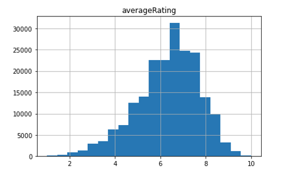
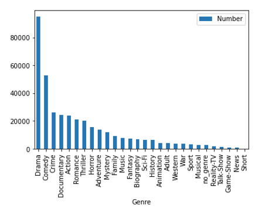
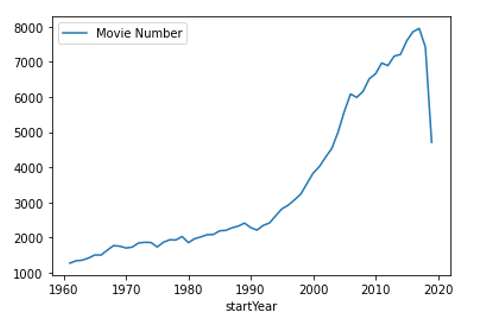
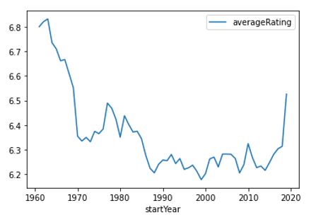
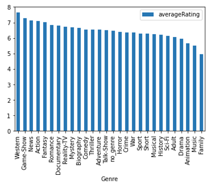
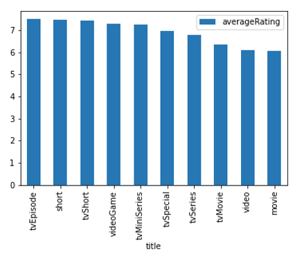
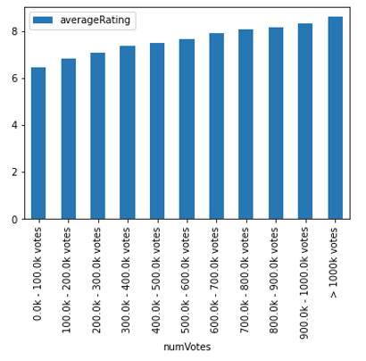
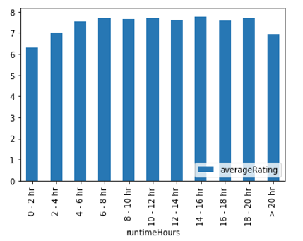
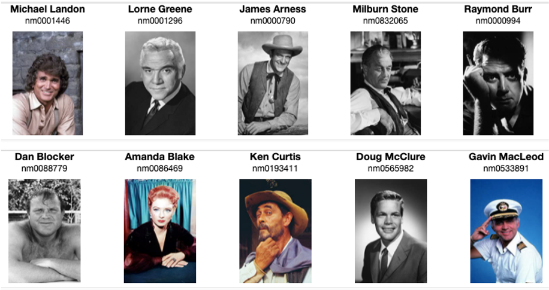
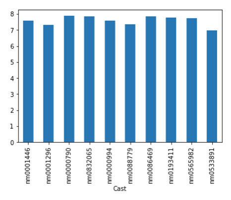

# imdb-rating
預測 imdb 電影評分，並利用 embedding 比較演員之間相似度差異

## 任務介紹
- 預測 imdb 電影評分
  - 使用年份、片長、風格、演員等等變數
- Actor Embedding Learning
  - 使用 Actor Embedding 來取代 One-hot Encoding
- 比較不同演員的性質異同
  - 使用 Actor Embedding 來計算相似度

## 資料集來源
- [Dataset](https://www.kaggle.com/datasets/ashirwadsangwan/imdb-dataset)
  - title.basics.tsv
  - title.ratings.tsv
  - title.principals.tsv

## 資料探索
透過 EDA 有以下觀察
- 資料分布情形
  - 大部分電影的平均分數落在 5 - 8 分之間
  
  - 類型最多的電影為 Drama，第二為 Comedy
  
  - 近年越來越多電影上映，然而電影分數卻越來越低
  
  
- 部分欄位與平均分數關係
  - 平均分數最高的電影種類為 Western，最低為 Family
  
  - 平均分數最高的類型為電視劇(tvEpisode)，最低為電影(movie)
  
  - 票數越高的電影，平均分數也越高
  
  
  - 總長度在 4 小時以下、20 小時以上的電影，平均分數略低
  
- 演出人員
  - 演出前 10 高的演員平均分數都在 7 分以上且差異不大
  
  
 
 
 
 
